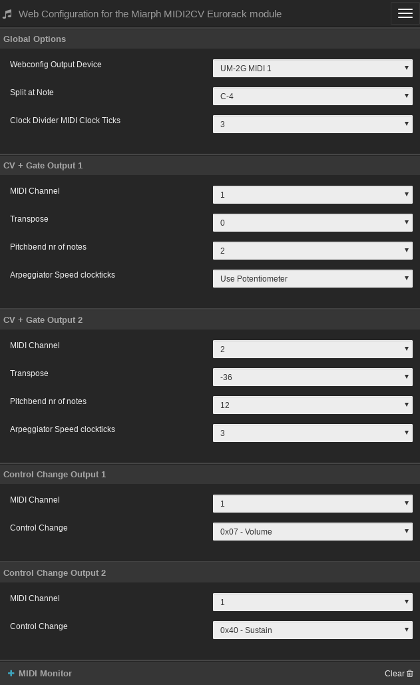

MIARPH * MIDI2CV + ARPEGGIATOR
==============================

Miarph is an Arduino based MIDI2CV converter with 4 0-5V 12 bit DAC's and 10 trigger outputs.


[](http://www.youtube.com/watch?v=SEof3n9Ys9w)

[](http://www.youtube.com/watch?v=0akh9hcQQY0)

## Features

* 4 individual 0-5v 12 bit DAC's (MCP4922 based)
* 10 Trigger outputs
* Dual Arpeggiator
* SYSEX configurable.
* Two MIDI-CC controller outputs.
* Two Midi Note + Trigger outputs.
* Split note (single channel) or two individual channel operations.

## Building Notes

* Use a real Arduino Nano or atleast one with a real FTDI chip.
* There is no tuning possibility, but a stable LM7805 is key.
* The LED is on the wrong side but easy fixable using 2 short wires. (This is the only mistake on the PCB).
* The LED resistor is dependent on your LED specs.
* Capacitors have three holes, always use the square one and one of the others. Both 2.54mm and 5.08mm caps will fit.
* Polarized caps should have their positive in the square hole and the negative pointing outwards the board. (See image above!)
* Remove the jumper and power cable before programming!
* DO NOT CONNECT POWER AND USB AT THE SAME TIME!

## BUGS

* It crashes at split note change. But after a reset it is correctly read from eeprom.
* Trigger outputs are just an 8 port clock divider atm.
* Transpose is buggy, but required because it can only support 60 MIDI notes.

## Programming Using Webconfig

See https://midi.tomarus.io/miarph/

You need a modern browser like Opera or Chrome to use this site.

Note that all values are initially *unknown* until you actually change something.
The device has no MIDI output so config values can't be read back.

After initially building the device, you should set all of your defaults once via webconfig.
After changing values it is stored on the device's eeprom and used at the next power up.



## Programming Using the Commandline

Use the ```midi2cv``` Go utility to program the device.

Example:

```./midi2cv write 0x01 0x77```

Where ```0x01``` is the address and ```0x77``` the value.

List of addresses to program:

| Address | Description | Example value |
| -- | -- | -- |
| 0x00 | unused | -- |
| 0x01 | Split keyboard at note | 0x40 (use 0x00 for no split) |
| 0x02 | MIDI 1 Channel | 0x01 |
| 0x03 | MIDI 2 Channel | 0x02 |
| 0x04 | Transpose Channel 1 | 0x40 |
| 0x05 | Transpose Channel 2 | 0x40 |
| 0x06 | Control Change Number Channel 1 | 0x07 (0x07 = volume) |
| 0x07 | Control Change Number Channel 2 | 0x6A (0x6A = filter cutoff) |
| 0x08 | Control Change Channel 1 | 0x01 |
| 0x09 | Control Change Channel 2 | 0x02 |
| 0x0a | Pitchbend Channel 1 | 0x02 (number of notes) |
| 0x0b | Pitchbend Channel 2 | 0x0c (number of notes) |
| 0x0c | Midi Channel 1 sync | 0x00 (00 = use potmeter, otherwise nr of midi clock ticks) |
| 0x0d | Midi Channel 2 sync | 0x00 (00 = use potmeter, otherwise nr of midi clock ticks) |
| 0x0e | Clockticks to advance the clock divider | 0x03 (0x03 = sync to quarter notes) |
| 0x0f | unused | -- |

## Bill Of Materials

|Designator                   |Package                                             |Quantity|Designation      |
|-----------------------------|----------------------------------------------------|--------|-----------------|
|RV1                          |Potentiometer_Alps_RK09K_Single_Vertical_HalfSilk   |1       |B10K             |
|NANO                         |Arduino_Nano_Silk                                   |1       |Nano v3          |
|C1                           |GenericCap                                          |1       |100uF            |
|C2                           |GenericCap                                          |1       |10uF             |
|C3,C4,C5,C6,C7,C8,C9         |GenericCap                                          |7       |100nF            |
|D1                           |LED_D3.0mm                                          |1       |LED              |
|D2,D3,D4                     |D_DO-35_SOD27_P7.62mm_Horizontal                    |3       |D                |
|J1                           |PinHeader_1x02_P2.54mm_Vertical                     |1       |ProgramJmpr      |
|J2                           |IDC-Header_2x05_P2.54mm_Vertical                    |1       |Power            |
|J3,J14,J15                   |PinSocket_1x04_P2.54mm_Vertical                     |3       |Conn_01x04_Male  |
|J4,J24,J25                   |PinHeader_1x04_P2.54mm_Vertical                     |3       |Conn_01x04_Female|
|J5                           |PinSocket_1x08_P2.54mm_Vertical                     |1       |Conn_01x08_Male  |
|J6                           |PinHeader_1x08_P2.54mm_Vertical                     |1       |Conn_01x08_Female|
|J7                           |Jack_3.5mm_QingPu_WQP-PJ366ST_Vertical_CircularHoles|1       |Midi Input       |
|J8-J13,J16-J23               |Jack_3.5mm_QingPu_WQP-PJ398SM_Vertical_CircularHoles|14      |Misc             |
|R1,R2                        |R_Axial_DIN0207_L6.3mm_D2.5mm_P7.62mm_Horizontal    |2       |2K2              |
|R3,R4,R5,R6                  |R_Axial_DIN0207_L6.3mm_D2.5mm_P7.62mm_Horizontal    |4       |1K               |
|R7                           |R_Axial_DIN0207_L6.3mm_D2.5mm_P7.62mm_Horizontal    |1       |220/470          |
|R8,R9,R10,R11,R12,R13,R14,R15|R_Axial_DIN0207_L6.3mm_D2.5mm_P7.62mm_Horizontal    |8       |100              |
|U1                           |TO-220-3_Horizontal_TabDown                         |1       |L7805            |
|U2                           |DIP-8_W7.62mm                                       |1       |24LC256          |
|U5                           |DIP-4_W7.62mm                                       |1       |PC817            |
|U6,U8                        |DIP-14_W7.62mm                                      |2       |TL074            |
|U7                           |DIP-16_W7.62mm                                      |1       |74HC595          |
|U3,U4                        |DIP-14_W7.62mm                                      |2       |MCP4922          |
