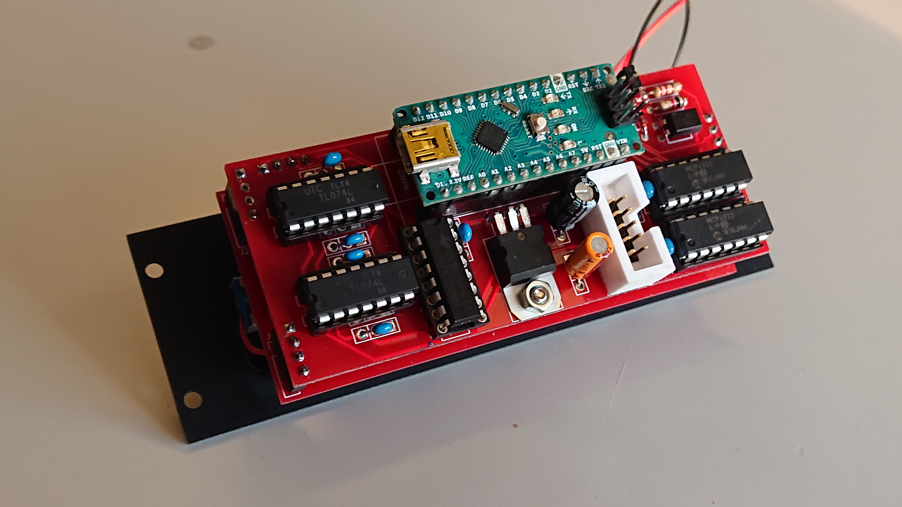

MIDI2CV + ARPEGGIATOR
=====================




[](http://www.youtube.com/watch?v=SEof3n9Ys9w)

[](http://www.youtube.com/watch?v=0akh9hcQQY0)

## Programming

Use the ```midi2cv``` Go utility to program the device.

Example:

```./midi2cv write 0x01 0x77```

Where ```0x01``` is the address and ```0x77``` the value.

List of addresses to program:

| Address | Description | Example value |
| -- | -- | -- |
| 0x00 | unused | -- |
| 0x01 | Split keyboard at note | 0x40 |
| 0x02 | MIDI 1 Channel | 0x01 |
| 0x03 | MIDI 2 Channel | 0x02 |
| 0x04 | Transpose Channel 1 | 0x40 |
| 0x05 | Transpose Channel 2 | 0x40 |
| 0x06 | Control Change Number Channel 1 | 0x07 (0x07 = volume) |
| 0x07 | Control Change Number Channel 2 | 0x6A (0x6A = filter cutoff) |
| 0x08 | Control Change Channel 1 | 0x01 |
| 0x09 | Control Change Channel 2 | 0x02 |
| 0x0a | Pitchbend Channel 1 | 0x02 (number of notes) |
| 0x0b | Pitchbend Channel 2 | 0x0c (number of notes) |
| 0x0c | Midi Channel 1 sync | 0x00 (00 = use potmeter, otherwise nr of midi clock ticks) |
| 0x0d | Midi Channel 2 sync | 0x00 (00 = use potmeter, otherwise nr of midi clock ticks) |
| 0x0e | Clockticks to advance the clock divider | 0x03 (0x03 = sync to quarter notes) |
| 0x0f | unused | -- |
